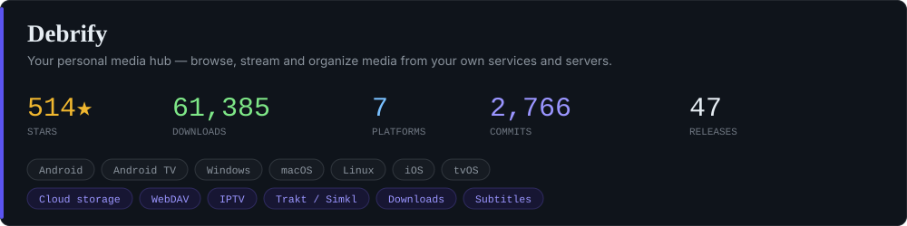
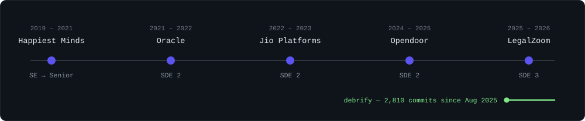
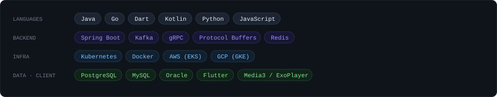

<picture>
  <source media="(prefers-color-scheme: dark) and (max-width: 520px)" srcset="assets/boot-dark-sm.svg">
  <source media="(prefers-color-scheme: light) and (max-width: 520px)" srcset="assets/boot-light-sm.svg">
  <source media="(prefers-color-scheme: dark)" srcset="assets/boot-dark.svg">
  <source media="(prefers-color-scheme: light)" srcset="assets/boot-light.svg">
  
</picture>

Seven years building backend systems that need to stay up — user services at 99.99%, event-driven pipelines, compliance plumbing across thirty-odd microservices.

Then I go home and write Flutter.

<picture>
  <source media="(prefers-color-scheme: dark) and (max-width: 520px)" srcset="assets/hdr-debrify-dark-sm.svg">
  <source media="(prefers-color-scheme: light) and (max-width: 520px)" srcset="assets/hdr-debrify-light-sm.svg">
  <source media="(prefers-color-scheme: dark)" srcset="assets/hdr-debrify-dark.svg">
  <source media="(prefers-color-scheme: light)" srcset="assets/hdr-debrify-light.svg">
  
</picture>

<a href="https://github.com/varunsalian/debrify">
  <picture>
    <source media="(prefers-color-scheme: dark) and (max-width: 520px)" srcset="assets/card-debrify-dark-sm.svg">
  <source media="(prefers-color-scheme: light) and (max-width: 520px)" srcset="assets/card-debrify-light-sm.svg">
  <source media="(prefers-color-scheme: dark)" srcset="assets/card-debrify-dark.svg">
    <source media="(prefers-color-scheme: light)" srcset="assets/card-debrify-light.svg">
    
  </picture>
</a>

It started as a way to stop juggling four debrid dashboards. It's since grown a website, a subreddit and a Discord full of people who care about the details — which has been the best part by a distance.

**[Website](https://debrify.tv)** · **[Guides](https://debrify.tv/guides/)** · **[r/debrify](https://www.reddit.com/r/debrify/)** · **[Discord](https://discord.gg/xuAc4Q2c9G)** · **[Download](https://github.com/varunsalian/debrify/releases)**

<picture>
  <source media="(prefers-color-scheme: dark) and (max-width: 520px)" srcset="assets/hdr-also-dark-sm.svg">
  <source media="(prefers-color-scheme: light) and (max-width: 520px)" srcset="assets/hdr-also-light-sm.svg">
  <source media="(prefers-color-scheme: dark)" srcset="assets/hdr-also-dark.svg">
  <source media="(prefers-color-scheme: light)" srcset="assets/hdr-also-light.svg">
  
</picture>

**[stremio-addon-importer](https://github.com/varunsalian/stremio-addon-importer)** — a small browser extension that exports your installed Stremio addons as JSON. Handy when you're moving between setups.

<picture>
  <source media="(prefers-color-scheme: dark) and (max-width: 520px)" srcset="assets/hdr-work-dark-sm.svg">
  <source media="(prefers-color-scheme: light) and (max-width: 520px)" srcset="assets/hdr-work-light-sm.svg">
  <source media="(prefers-color-scheme: dark)" srcset="assets/hdr-work-dark.svg">
  <source media="(prefers-color-scheme: light)" srcset="assets/hdr-work-light.svg">
  
</picture>

<picture>
  <source media="(prefers-color-scheme: dark) and (max-width: 520px)" srcset="assets/timeline-dark-sm.svg">
  <source media="(prefers-color-scheme: light) and (max-width: 520px)" srcset="assets/timeline-light-sm.svg">
  <source media="(prefers-color-scheme: dark)" srcset="assets/timeline-dark.svg">
  <source media="(prefers-color-scheme: light)" srcset="assets/timeline-light.svg">
  
</picture>

<b>A few things I'm glad I got to build</b>

 

- **CCPA compliance at Opendoor**, as the only developer on it — RelyanceAI wired into 30+ microservices, with Kafka handling access and deletion requests so nothing was dropped and everything stayed auditable. Saved ~$30K in vendor cost and headed off $50K+ in penalties.
- **KOPS → Amazon EKS** for production services, taking 25% off the infrastructure bill along the way.
- **The User Details Service at Jio** — horizontally scalable, 99.99% availability, comfortable through 3× promotional traffic spikes on GKE.
- **Code review standards** that stuck around after I moved on, and three engineers I really enjoyed mentoring.

<picture>
  <source media="(prefers-color-scheme: dark) and (max-width: 520px)" srcset="assets/hdr-stack-dark-sm.svg">
  <source media="(prefers-color-scheme: light) and (max-width: 520px)" srcset="assets/hdr-stack-light-sm.svg">
  <source media="(prefers-color-scheme: dark)" srcset="assets/hdr-stack-dark.svg">
  <source media="(prefers-color-scheme: light)" srcset="assets/hdr-stack-light.svg">
  
</picture>

<picture>
  <source media="(prefers-color-scheme: dark) and (max-width: 520px)" srcset="assets/toolkit-dark-sm.svg">
  <source media="(prefers-color-scheme: light) and (max-width: 520px)" srcset="assets/toolkit-light-sm.svg">
  <source media="(prefers-color-scheme: dark)" srcset="assets/toolkit-dark.svg">
  <source media="(prefers-color-scheme: light)" srcset="assets/toolkit-light.svg">
  
</picture>

---

Happily busy with my own projects at the moment — but I always enjoy hearing about an interesting problem.

[varunbsalian@gmail.com](mailto:varunbsalian@gmail.com) · [LinkedIn](https://www.linkedin.com/in/varun-salian-691641150/)
